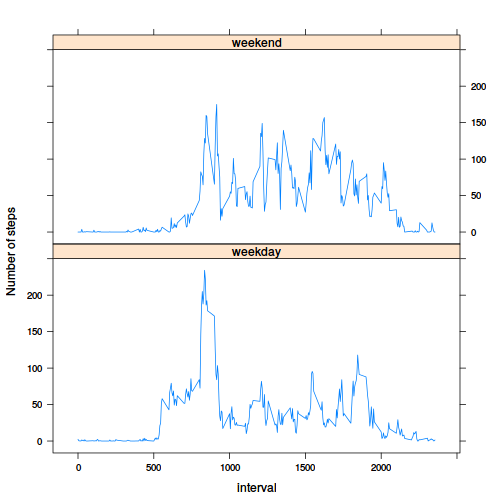

# Reproducible Research: Peer Assessment 1


## Loading and preprocessing the data
The load the data the archive is unzipped and then contained csv file is read. The date entities are parsed as date objects. Some measurements are incomplete, so a separate set (`activityNonNa`) is created that only has complete measurements (i.e. steps is not NA).


```r
unzip('activity.zip')
measurements <- read.csv('activity.csv')
measurements$date <- as.Date(measurements$date)
measurementsComplete <- measurements[complete.cases(measurements), ]
```

The loaded and cleaned measurements have the following fields:

* steps: Number of steps taking in a 5-minute interval (missing values are coded as NA)

* date: The date on which the measurement was taken as Date

* interval: Identifier for the 5-minute interval in which measurement was taken, coded as hhmm (e.g. "5" for 00:05 and 1450 for 14:50)


## What is mean total number of steps taken per day?
First, a list of the sum of steps per day is created. So, for each day with one or more complete measurements, the list contains an entry with the total amount of steps recorded.  


```r
totalStepsPerDay <- by(measurementsComplete, measurementsComplete$date, function(m) { 
    sum(m$steps) 
})
hist(totalStepsPerDay, xlab='Total steps per day', main='Histogram of total steps per day')
```

 

From this list **the mean and median of total steps per day** can be calculated:


```r
meanStepsPerDay <- mean(totalStepsPerDay)
meanStepsPerDay
```

```
## [1] 10766
```


```r
medianStepsPerDay <- median(totalStepsPerDay)
medianStepsPerDay
```

```
## 2012-11-12 
##      10765
```

## What is the average daily activity pattern?


```r
meansByInterval <- by(measurementsComplete, measurementsComplete$interval, function(m) { 
    mean(m$steps)
})
intervals <- names(meansByInterval)
plot(x=intervals, meansByInterval, type='l')
```

 

The maximum mean is

```r
max(meansByInterval)
```

```
## [1] 206.2
```

The interval with corresponding to the maximum mean is:


```r
intervals[meansByInterval == max(meansByInterval)]
```

```
## [1] "835"
```

## Imputing missing values
Some measurements are incomplete. There should only be missings steps, and no missing values for date or interval:


```r
list(
    incompleteMeasurements=nrow(measurements[!complete.cases(measurements), ]),
    missingSteps = nrow(measurements[is.na(measurements$steps),]),
    missingDates = nrow(measurements[is.na(measurements$date),]),
    missingInterval = nrow(measurements[is.na(measurements$interval),])
)
```

```
## $incompleteMeasurements
## [1] 2304
## 
## $missingSteps
## [1] 2304
## 
## $missingDates
## [1] 0
## 
## $missingInterval
## [1] 0
```

Some missing values are:


```r
head(measurements[is.na(measurements$steps),])
```

```
##   steps       date interval
## 1    NA 2012-10-01        0
## 2    NA 2012-10-01        5
## 3    NA 2012-10-01       10
## 4    NA 2012-10-01       15
## 5    NA 2012-10-01       20
## 6    NA 2012-10-01       25
```

The missing values will be imputed with the mean of the step measurements. The following filler function is used:


```r
filler <- function(step, interval, meansByIntervalList) {
    index <- as.character(interval)
    ifelse(is.na(step), meansByIntervalList[[index]], step)
}
```

Using the filler function a data set with imputed values is created: 


```r
imputed <- measurements
imputed$steps <- mapply(filler, imputed$steps, imputed$interval, MoreArgs=list(as.list(meansByInterval)))

head(imputed[is.na(measurements$steps), ])
```

```
##     steps       date interval
## 1 1.71698 2012-10-01        0
## 2 0.33962 2012-10-01        5
## 3 0.13208 2012-10-01       10
## 4 0.15094 2012-10-01       15
## 5 0.07547 2012-10-01       20
## 6 2.09434 2012-10-01       25
```

### Testing the impact of imputing data
To get a sense of the impact of imputing, a histogram is created as shown below, to compare the results side by side.


```r
totalStepsPerDayImputed <- by(imputed, imputed$date, function(m) { 
    sum(m$steps)
})

totalStepsByDayImputed <- by(imputed, imputed$date, function(m) { 
    sum(m$steps) 
})

par(mfrow=c(1,2))
hist(totalStepsPerDay, xlab='Total steps per day', main='Without incomplete data', ylim=c(0,40))
hist(totalStepsByDayImputed, xlab='Total steps per day', main='With imputed data', ylim=c(0,40))
```

 

Only the frequency of the the of the average amount of steps per day is increased, presumably since the missing values where filled with the average amounts. Also, because average values were added, it is expected that the mean will not change and the median may shift a little towards the mean.


```r
meanStepsPerDayImputed <- mean(totalStepsPerDayImputed)
medianStepsPerDayImputed <- median(totalStepsPerDayImputed)

list(
    meanStepsPerDay=meanStepsPerDay,
    meanStepsPerDayImputed=meanStepsPerDayImputed,
    medianStepsPerDay=medianStepsPerDay,
    medianStepsPerDayImputed=medianStepsPerDayImputed
)
```

```
## $meanStepsPerDay
## [1] 10766
## 
## $meanStepsPerDayImputed
## [1] 10766
## 
## $medianStepsPerDay
## 2012-11-12 
##      10765 
## 
## $medianStepsPerDayImputed
## 2012-11-04 
##      10766
```

I suspect that the impact of imputing missing data means that estimates move toward mean of the non-missing values.

## Are there differences in activity patterns between weekdays and weekends?
To see if there are differences between activity patterns in weekdays and weekends, we add a factor to indicate that the measurement was taken in the weekend or on a weekday. Note that the non imputed, complete measurements are used and not the incomplete or imputed list.


```r
inWeekend <- weekdays(measurementsComplete$date) %in% c('Saturday', 'Sunday')
dayFactor <- factor(ifelse(inWeekend, 'weekend', 'weekday'))
measurementsComplete$dayFactor <- dayFactor

table(measurementsComplete$dayFactor)
```

```
## 
## weekday weekend 
##   11232    4032
```

The dataset can now be split by interval and day factor. For each interval and day factor, the mean of measured steps is calculated. In the diagram below the means of the steps per interval are plotted for both weekend and weekday days.


```r
# calculate amount of step means by interval and day factor
library(plyr)
steps <- ddply(measurementsComplete, .(interval, dayFactor), function(piece) {
    mean(piece$steps)
})
names(steps)[3] <- 'steps'

# plot steps versus interval grouped by day factor
library(lattice)
xyplot(steps ~ interval | dayFactor, steps, layout=c(1,2), type='l', ylab='Number of steps')
```

 
